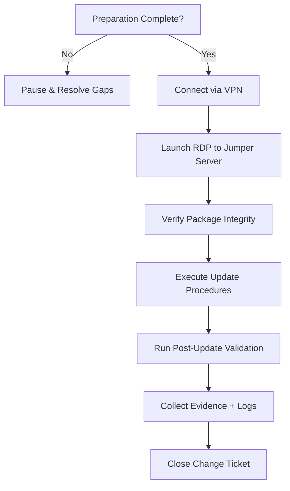
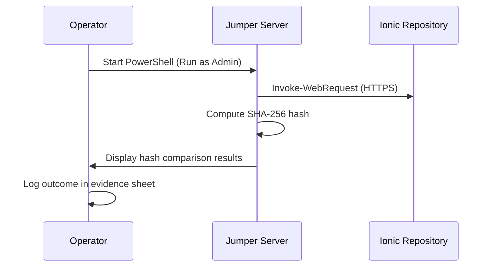
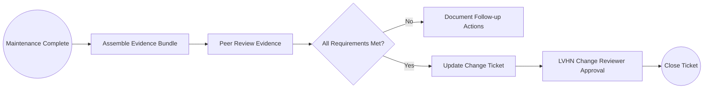

# LVHN eKVM Remote Update – Operator User Manual

> **Configuration Custody Notice**  
> Ionic Health engineering exclusively manages all eKVM configuration, firmware, and software changes, including patch execution via the jumper server. LVHN operations is solely responsible for provisioning, hardening, and maintaining the Windows jumper server. cross-domain actions require written approval from both teams.

> **Network Visibility Scope**  
> Operators only require connectivity through the LVHN jumper server; Ionic Health does not inspect or manage LVHN internal network segments beyond that demarcation.

## 1. Audience and Scope

This manual guides Ionic Health operators through the end-to-end process of updating eKVM devices via the LVHN-managed Windows jumper server. All instructions assume the operator has approved change tickets and VPN credentials issued by LVHN.

## 2. Pre-Window Checklist

| Step | Validation | Responsible |
|------|------------|-------------|
| Confirm change ticket approval. | ServiceNow status = "Approved" | Ionic PMO |
| Verify maintenance window time and device list. | Change ticket attachments | Ionic Operator |
| Ensure VPN credentials + MFA token are active. | LVHN IAM confirmation | Ionic Operator |
| Confirm ACL change request executed. | Connectivity test to jumper server (TCP 3389) | LVHN Network |
| Download latest firmware/software hashes. | Ionic release portal | Ionic Operator |

## 3. Quick Navigation Diagram



## 4. Connecting to the Environment

1. Launch LVHN SSL VPN client and authenticate with username, password, and MFA.
2. Confirm tunnel status shows maintenance VLAN access (per LVHN VPN guide).
3. Open Remote Desktop Connection:
   - Host: `jumper-server-01.lvhn.local`
   - Credentials: JIT account provided for the window.
   - Verify NLA prompt to ensure secure channel.

## 5. Integrity Validation



Example command:
```powershell
$expectedHash = "<SHA256_FROM_RELEASE_PORTAL>"
$binaryPath = "C:\eKVM\Packages\eKVM-Firmware-3.2.1.exe"
(Get-FileHash -Path $binaryPath -Algorithm SHA256).Hash -eq $expectedHash
```

## 6. Executing the Update

Follow `docs/procedures/MOP-eKVM-Update.md` Section 5. Key checkpoints:
- Snapshot current eKVM configuration using WinRM script.
- Run firmware installer silently:
  ```powershell
  Start-Process $binaryPath -ArgumentList "/quiet /norestart" -Wait
  ```
- Monitor installation logs under `C:\eKVM\Logs`.

## 7. Post-Update Validation

| Validation | Command / Action | Expected Result |
|------------|------------------|-----------------|
| Device reachable | `Test-NetConnection <eKVM-IP> -Port 5986` | `TcpTestSucceeded: True` |
| Version check | `Get-Item "\\<eKVM-IP>\C$\Program Files\Ionic\eKVM\version.txt"` | Matches release version |
| Service health | `Get-Service -ComputerName <eKVM-IP> Ionic*` | Status = Running |
| Event logs | Filter Windows Event Viewer for errors post-update | No critical errors |

## 8. Evidence Collection

- Export PowerShell transcript: `Start-Transcript` / `Stop-Transcript`
- Capture hash verification screenshots.
- Download RDP session logs (if enabled) to evidence folder.
- Append SIEM query results demonstrating log ingestion.

## 9. Change Ticket Closure Workflow



### Required Attachments
- PowerShell transcripts
- Hash verification results
- eKVM version validation screenshot/log
- SIEM confirmation logs
- Incident notes (if anomalies occurred)

## 10. Troubleshooting Reference

| Symptom | Possible Cause | Resolution |
|---------|----------------|------------|
| Cannot reach jumper server | VPN tunnel or ACL inactive | Re-open change ticket with LVHN network; confirm schedule |
| Hash mismatch | Corrupted download or wrong package | Re-download; confirm hash from release portal; escalate to Ionic QA |
| Patch script timeout | WinRM throttling or service hang | Restart WinRM service on eKVM (`winrm quickconfig`), re-run script |
| Logs missing in SIEM | Event forwarding service stopped | Restart Windows Event Forwarding service; notify LVHN SOC |

## 11. References

- `docs/procedures/MOP-eKVM-Update.md`
- `docs/solution/Functional-Solution-Design.md`
- `runbooks/RDP-Hardening-Guide.md`
- `runbooks/WinRM-Setup-and-File-Transfer.md`
