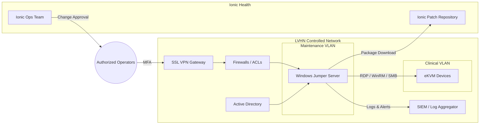
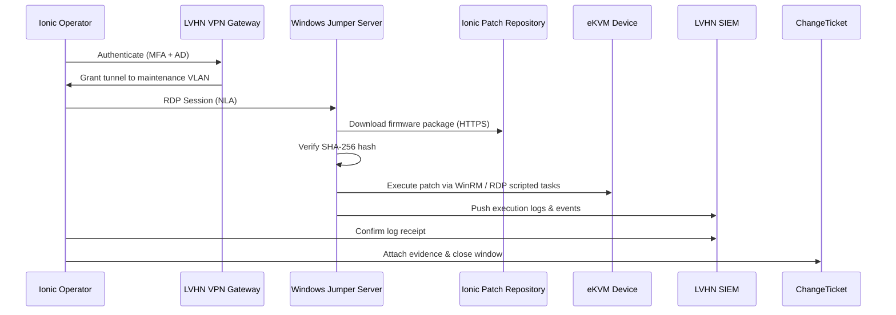

# LVHN eKVM Remote Update – Functional Solution Design

> **Configuration Custody Notice**  
> Ionic Health engineering exclusively manages all eKVM configuration, firmware, and software changes, including patching operations executed via the jumper server. LVHN operations is solely responsible for provisioning, hardening, and maintaining the Windows jumper server in line with the requirements defined in this specification. Any cross-domain action demands documented approval from both organizations.

> **Network Visibility Scope**  
> Ionic Health does not require visibility into LVHN s broader network, only assurance that the LVHN-managed jumper server can reach Ionic-managed eKVM devices via the agreed outbound path.

## 1. Purpose

This document describes the functional architecture of the LVHN eKVM Remote Update solution, clarifying system responsibilities, data flows, and operational safeguards needed to deliver compliant patching operations through the Windows jumper server managed by LVHN.

## 2. Stakeholders and Responsibilities

| Stakeholder | Responsibilities |
|-------------|------------------|
| LVHN IT Operations | Provision, harden, and monitor the Windows jumper server; enforce network controls; coordinate change management. |
| Ionic Health Engineering | Prepare and validate eKVM firmware/software packages; execute patching via jumper server; maintain eKVM configuration baselines. |
| LVHN Security & Compliance | Validate audit evidence, review logs, and ensure adherence to regulatory frameworks. |
| Ionic Health Project Management | Coordinate maintenance windows, documentation updates, and cross-team communication. |

## 3. High-Level Architecture Diagram

## 4. Functional Domains

### 4.1 Access Control
- LVHN provisions named JIT accounts in Active Directory with least privilege.
- Jumper server enforces MFA via VPN, NLA for RDP, and Just-In-Time account activation (enable H-0, disable H+1).

### 4.2 Patching Workflow
1. Ionic Health publishes signed firmware/software package to repository.
2. LVHN validates maintenance window and network ACLs.
3. Ionic operator connects via SSL VPN and RDP to jumper server.
4. Operator downloads package to jumper server, verifies SHA-256 hash.
5. Using WinRM or RDP session, operator triggers eKVM patch sequence following MOP.
6. Evidence (logs, hashes, screenshots) is archived and shared with LVHN compliance.

### 4.3 Monitoring & Logging
- Jumper server forwards Security, PowerShell, and RDP logs to LVHN SIEM.
- Firewall logs capture time-bound ACL activations.
- Hash verification evidence stored in Ionic repository and change ticket.

## 5. Data Flow Diagram

## 6. Functional Requirements Summary

| ID | Requirement | Owner |
|----|-------------|-------|
| FR-01 | Jumper server must run Windows Server 2022/2019 with hardened baseline. | LVHN |
| FR-02 | VPN access must enforce MFA and named accounts. | LVHN |
| FR-03 | eKVM patch packages must include SHA-256 verification data. | Ionic |
| FR-04 | Maintenance actions must be initiated exclusively by Ionic Health operators. | Ionic |
| FR-05 | All operational logs must be forwarded to LVHN SIEM within 5 minutes. | LVHN |
| FR-06 | Change tickets must reference evidence bundle per MOP Section 9. | Ionic |
| FR-07 | Network ACLs must be time-boxed to maintenance window. | LVHN |

## 7. Non-Functional Requirements

- **Security:** FIPS 140-2 compliant cryptography, CIS Level 1 baseline, TLS 1.2+.
- **Availability:** Jumper server must maintain 99.9% availability outside planned maintenance.
- **Observability:** Correlation IDs embedded in PowerShell scripts to trace operations.
- **Compliance:** Align with HIPAA, NIST SP 800-53, CIS Controls v8.

## 8. Integration Points

| Integration | Description | Interface |
|-------------|-------------|-----------|
| Active Directory | Provides authentication, group policy enforcement, and JIT account lifecycle. | Kerberos/LDAP |
| VPN Gateway | Enforces MFA and network segmentation. | SSL VPN |
| Ionic Patch Repository | Secure distribution of firmware/software packages. | HTTPS (TLS 1.2+) |
| SIEM Platform | Collects operational and security logs for audits. | WinRM/Event Forwarding |

## 9. Risk Register (Top Items)

| Risk | Impact | Mitigation |
|------|--------|------------|
| Unauthorized jumper access | High | Enforce MFA, audit logs, JIT accounts, network segmentation. |
| Hash mismatch during deployment | High | Mandatory SHA-256 check with automated validation scripts. |
| SIEM ingestion failure | Medium | Health check scripts and alerting on log gaps >10 min. |
| ACL misconfiguration | Medium | Change tickets require double review; pre-window connectivity testing. |

## 10. References

- `docs/procedures/MOP-eKVM-Update.md`
- `runbooks/RDP-Hardening-Guide.md`
- `runbooks/WinRM-Setup-and-File-Transfer.md`
- `specs/Technology-Stack-Specification.md`
